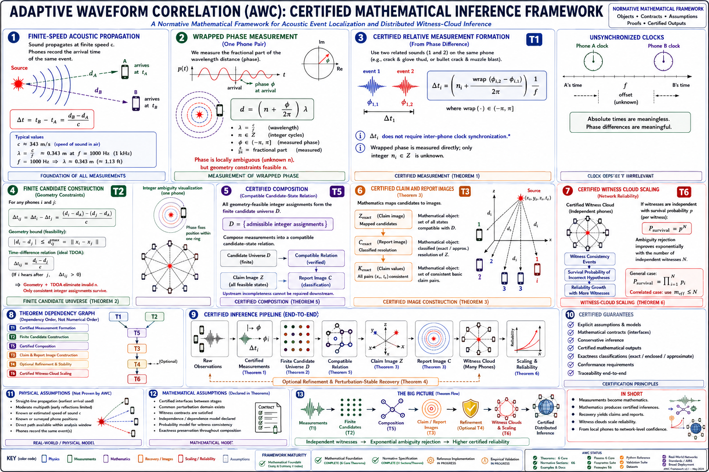

# Adaptive Waveform Correlation (AWC)

> **A research framework for conditional acoustic inference, finite ambiguity analysis, report closure, perturbation stability, composition, and distributed witness-cloud scaling**

Adaptive Waveform Correlation (AWC) is a mathematical research framework for analyzing acoustic observations collected by asynchronous and distributed devices. The framework does not treat a solver output as self-validating. Instead, it separates measurements, assumptions, candidate hypotheses, report classes, perturbation domains, composition contracts, and scaling claims so that every conclusion can be traced to declared conditions.

AWC is developed alongside the **Draft Acoustic Incident Reconstruction Specification (AIRS)**, which defines a proposed auditable workflow for physics-constrained analysis of separately acquired recordings.

> [!IMPORTANT]
> This repository is a research specification, not a validated forensic standard, certified localization product, or completed software implementation. The theorem documents are at mixed draft and frozen maturity levels, and the repository does not yet contain a reference implementation, benchmark dataset, or reproducible validation pipeline.



## Framework principles

AWC is organized around the following principles:

- every certification claim is conditional on explicit assumptions;
- model compatibility is not the same as physical truth, authenticity, or causality;
- wrapped-phase ambiguity must be represented rather than silently discarded;
- exact results and conservative enclosures must remain distinguishable;
- report-level closure is distinct from candidate-level or state-set closure;
- theorem interfaces must preserve units, coordinates, perturbation domains, and semantics;
- witness scaling requires declared probability and dependence assumptions;
- numerical convergence alone does not establish a valid inference.

## Repository status

The first-generation **theorem architecture is defined**, but the repository is not yet a completed, independently validated end-to-end system.

| Area | Current state |
|---|---|
| AIRS specification | Stable research draft 0.1; not independently validated |
| Theorems 1–2 | Mathematical drafts |
| Theorems 3–4 | Frozen 1.0 research documents |
| Theorem 5 | Mathematical draft, version 2.0.0-beta1 |
| Theorem 6 | Draft document; version/status metadata still needs to be formalized |
| Reference implementation | Not yet included |
| Automated tests | Not yet included |
| Reproducible empirical validation | Not yet included |
| Figures | Conceptual, architectural, comparative, or proposed evaluation assets |

## Theorem series

| Theorem | Document | Declared maturity | Validation status |
|---|---|---|---|
| T1 | [Conditional Relative Same-Event Measurement Formation](Theorems/Theorem_1_Conditional_Relative_Same_Event_Measurement_Formation.md) | Theorem Draft 0.5 | Not independently validated |
| T2 | [Finite Integer Ambiguity Under Bounded Admissible Differences](Theorems/Theorem_2_Finite_Integer_Ambiguity_Under_Bounded_Admissible_Differences.md) | Theorem Draft 0.7 | Not independently validated |
| T3 | [Conditional Resolution-Level Report Closure and Classification](Theorems/Theorem_3_Conditional_Resolution_Level_Report_Closure_and_Classification.md) | Frozen 1.0 | Not independently validated |
| T4 | [Conditional Perturbation-Stable Candidate and Report-Class Recovery](Theorems/Theorem_4_Conditional_Perturbation_Stable_Candidate_and_Report_Class_Recovery.md) | Frozen 1.0 | Not independently validated |
| T5 | [Conditional End-to-End Inference Composition](Theorems/Theorem_5_Conditional_End-to-End_Inference_Composition.md) | Mathematical Draft, 2.0.0-beta1 | Not independently validated |
| T6 | [Certified Witness-Cloud Scaling](Theorems/Theorem_6_Certified_Witness-Cloud_Scaling.md) | Draft; metadata pending | No independent validation documented |

> **Status terminology:** “Draft,” “Frozen,” and version numbers report the documents’ internal revision states. They do not imply independent review, mechanized verification, empirical validation, or external certification.

### What each theorem addresses

**T1 — Measurement formation.** Defines conditions under which two observers may produce a bounded-error, relative, same-event wrapped-phase observation. It does not infer absolute source range from raw phase.

**T2 — Finite integer ambiguity.** Gives sufficient conditions under which integer-cycle ambiguity reduces to a finite discrete search domain. It does not guarantee existence, uniqueness, or physical correctness of a surviving candidate.

**T3 — Report closure and classification.** Defines conditions for determining the report-class image of an admissible solution set at a declared resolution, while distinguishing report closure from stronger candidate- or state-level closure.

**T4 — Perturbation-stable recovery.** Gives sufficient conditions for candidate, report-class, or local state stability over a declared uncertainty set. Objective separation does not by itself establish truth or authenticity.

**T5 — End-to-end composition.** Specifies conditions under which the outputs and assumptions of Theorems 1–4 may be composed without silently strengthening or changing their meanings.

**T6 — Witness-cloud scaling.** Develops conditional results for incorrect-hypothesis suppression and combining witness evidence. Its conclusions depend on the stated probability, independence, dependence, retention, and geometric assumptions; empirical effectiveness remains outside the theorem alone.

## Dependency and processing views

The repository distinguishes **formal theorem dependency**, **related workflow context**, and **conceptual processing flow**.

### Formal theorem dependency

```text
T1
 │
 ▼
T2
 │
 ▼
T3
 │
 ▼
T4
 │
 ▼
T5: composition of T1–T4
 │
 ▼
T6: scaling over certified inference
```

This diagram describes how the current theorem documents cite and consume earlier results. It is not intended to imply that every implementation must execute the documents as ordinary sequential software stages.

### Related workflow specification

```text
AIRS Draft 0.1
Proposed reconstruction workflow and audit context
```

AIRS provides methodological and procedural context for reconstruction work. It should not be interpreted as a mathematical premise of the theorem series unless a theorem explicitly imports an AIRS definition, assumption, or contract.

### Conceptual inference flow

```text
Raw observations
      │
      ▼
Optional E0 raw-observation interface
      │
      ▼
T1: bounded relative measurements
      │
      ▼
T2: finite integer-hypothesis domain
      │
      ▼
T3: admissible state/report images
      │
      ├──► Optional T4: stability/refinement outputs ──┐
      │                                               │
      └───────────────────────────────────────────────┤
                                                      ▼
T5: composition of required interfaces and any
    declared optional refinement interfaces
      │
      ▼
T6: incorrect-hypothesis suppression and multi-witness
    scaling under declared probabilistic assumptions
```

## AIRS documentation

- [Draft Acoustic Incident Reconstruction Specification (AIRS) 0.1](docs/AIRS_Standard.md)
- [AIRS Troubleshooting Guide](docs/AIRS_Troubleshooting_Guide.md)

AIRS is a proposed research workflow for testing whether measurements remain compatible with declared timing, propagation, clock, source, path, and geometry models. It is not an independently validated forensic standard.

## Examples

The examples are explanatory research guides rather than validated case studies:

- [Bat Crack → Glove Thud](examples/Bat_to_Glove.md)
- [Concert Audio Analysis](examples/Concert_Reverberation.md)
- [Sports Stadium Audio Analysis](examples/Stadium_Analysis.md)

## Figures and architecture assets

Current flagship assets:

- [AWC Certified Mathematical Inference Framework](AWC_Framework.PNG)
- [AWC Comparative Analysis Framework](Layers/AWC_Comparative_Analysis_Framework.PNG)
- [AWC Computational Architecture](Layers/AWC_Computational_Architecture.PNG)
- [AWC Implementation Architecture](Layers/AWC_Implementation_Architecture.PNG)
- [AWC Empirical Validation Framework](Layers/AWC_Empirical_Validation_Framework.PNG)

The computational architecture describes the proposed flow of mathematical objects and contracts. The implementation architecture describes a proposed software-module decomposition. Neither figure establishes that the depicted implementation currently exists.

The figures communicate conceptual structure, target architecture, comparison criteria, and proposed empirical-evaluation organization. They must not be interpreted as proof that software modules, datasets, benchmarks, numerical performance claims, or field validation are present in this repository. Any numerical values shown in a figure require separate reproducible evidence before being treated as measured results.

Legacy conceptual images are retained under:

- [`Layers/diagrams/legacy-conceptual/`](Layers/diagrams/legacy-conceptual/)
- [`Theorems/diagrams/legacy-conceptual/`](Theorems/diagrams/legacy-conceptual/)
- [`diagrams/legacy-conceptual/`](diagrams/legacy-conceptual/)

## Speculative research notes

- [Cosmic Witness Cloud](research-notes/speculative/cosmic-witness-cloud.md)

Material under `research-notes/speculative/` is non-normative, exploratory, and outside the normative AWC theorem series unless separately formalized, reviewed, and incorporated.

## Repository layout

```text
AdaptiveWaveformCorrelation/
├── README.md
├── LICENSE
├── AWC_Framework.PNG
├── Theorems/
│   ├── Theorem_1_Conditional_Relative_Same_Event_Measurement_Formation.md
│   ├── Theorem_2_Finite_Integer_Ambiguity_Under_Bounded_Admissible_Differences.md
│   ├── Theorem_3_Conditional_Resolution_Level_Report_Closure_and_Classification.md
│   ├── Theorem_4_Conditional_Perturbation_Stable_Candidate_and_Report_Class_Recovery.md
│   ├── Theorem_5_Conditional_End-to-End_Inference_Composition.md
│   ├── Theorem_6_Certified_Witness-Cloud_Scaling.md
│   └── diagrams/legacy-conceptual/
├── docs/
│   ├── AIRS_Standard.md
│   └── AIRS_Troubleshooting_Guide.md
├── examples/
│   ├── Bat_to_Glove.md
│   ├── Concert_Reverberation.md
│   └── Stadium_Analysis.md
├── Layers/
│   ├── AWC_Comparative_Analysis_Framework.PNG
│   ├── AWC_Computational_Architecture.PNG
│   ├── AWC_Empirical_Validation_Framework.PNG
│   ├── AWC_Implementation_Architecture.PNG
│   └── diagrams/legacy-conceptual/
├── diagrams/legacy-conceptual/
└── research-notes/speculative/
    └── cosmic-witness-cloud.md
```

## Scope and non-claims

The current repository does **not** by itself certify or establish:

- hardware accuracy or sensor calibration;
- clock synchronization or communication reliability;
- source authenticity, causality, or evidence integrity;
- a unique physical source location in every case;
- production-quality implementation correctness;
- operational or forensic admissibility;
- empirical superiority over other methods;
- the numerical results depicted in illustrative figures;
- independent mathematical review or mechanized proof verification.

A conclusion is supported only to the extent that the applicable theorem assumptions, interface contracts, numerical requirements, and declared uncertainty domains are satisfied.

## Planned work

Near-term repository priorities include:

1. reconcile and formalize cross-theorem interface definitions;
2. standardize theorem metadata, headings, versioning, and dependency statements;
3. complete the mathematical scope and status metadata of Theorem 6;
4. add shared notation, glossary, and interface registries;
5. add primary-literature references and a formal citation file;
6. implement a reference computational realization with automated tests;
7. add reproducible validation protocols, datasets, scripts, and generated results;
8. add editable sources and provenance metadata for flagship figures.

## Citation

A formal citation record has not yet been added. When referencing the repository, identify the specific theorem or AIRS document, its declared version, and the repository revision used. Do not cite a conceptual figure as empirical evidence without the corresponding reproducible artifacts.

## License

Except where otherwise noted, the original documentation, diagrams, and images in this repository are licensed under the Creative Commons Attribution-ShareAlike 4.0 International License. See [LICENSE](LICENSE) for the repository notice. Third-party materials are excluded unless explicitly stated, and future software may use a separate software license.
