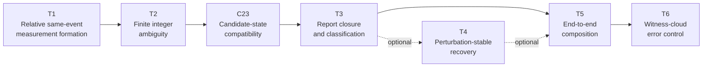

# Adaptive Waveform Correlation (AWC)

> **A theorem-aligned mathematical research framework for conditional acoustic inference, finite ambiguity analysis, candidate-state compatibility, report closure, optional perturbation stability, end-to-end composition, and witness-cloud error control.**

**README revision:** 2.0  
**Repository alignment date:** 2026-07-12  
**Repository status:** Research specification; non-operational; not independently validated

Adaptive Waveform Correlation (AWC) organizes acoustic inference as a sequence of explicit mathematical contracts. Measurements, discrete hypotheses, compatible state sets, report classes, perturbation domains, composition requests, probability models, and certificate statuses remain separate so that every conclusion can be traced to declared assumptions and domains.

AWC is developed alongside the **Draft Acoustic Incident Reconstruction Specification (AIRS)**, which provides a proposed procedural and audit framework for analyzing separately acquired recordings.

> [!IMPORTANT]
> This repository is not a reference implementation, validated forensic standard, certified localization product, benchmark study, or empirical performance claim. It contains mathematical research documents, an interface specification, AIRS documentation, explanatory examples, legacy diagrams, and a speculative research note. It does not contain executable AWC software, automated tests, benchmark data, or a reproducible validation pipeline.

## Core principles

- Every result is conditional on explicit assumptions, domains, models, and certificate scope.
- A model-compatible hypothesis is not automatically physically true, authentic, causal, or evidentially reliable.
- Wrapped-phase ambiguity must remain explicit until it is resolved or conservatively bounded.
- Exact candidate domains and conservative finite-precision supersets must not be conflated.
- A failed search, optimizer timeout, or empty inner approximation does not certify emptiness.
- Report-level closure is distinct from candidate-level closure and exact state-set closure.
- Optional perturbation stability does not convert a selected candidate into ground truth.
- End-to-end composition must preserve upstream meanings without strengthening them.
- Witness-cloud scaling requires an explicit target space, aggregation rule, probability model, dependence model, and error definitions.
- Non-resolution, incompatibility, partial coverage, and unresolved evaluation are valid reportable outcomes.

## Current architecture



Text form:

```text
T1 → T2 → C23 → T3 ─────────→ T5 → T6
                    └→ [T4] ─→┘
```

- **T1** forms conditional pairwise, relative, same-event wrapped-phase measurements.
- **T2** constructs finite exact or conservative integer-cycle candidate domains.
- **C23** is the required bridge from T2 candidates to T3-compatible refined state sets and coverage records.
- **T3** establishes exact or certified report images and resolution-level classification.
- **T4** is optional and addresses perturbation-stable candidate, report-class, or local-state recovery.
- **T5** verifies request-relative compatibility and preserves the certified conclusions of T1–T3, C23, and optional T4.
- **T6** combines T5-certified witness outputs under an explicit stochastic and dependence model.

## Document registry

All documents remain **not independently validated**. “Frozen” describes an internal revision state only; it does not imply peer review, mechanized proof verification, certification, or operational readiness.

| ID | Document | Current version and status |
|---|---|---|
| T1 | [Conditional Relative Same-Event Measurement Formation](Theorems/Theorem_1_Conditional_Relative_Same_Event_Measurement_Formation.md) | Theorem Draft 0.5; conditional mathematical result |
| T2 | [Finite Integer Ambiguity Under Bounded Admissible Differences](Theorems/Theorem_2_Finite_Integer_Ambiguity_Under_Bounded_Admissible_Differences.md) | Theorem Draft 0.7; conditional mathematical result |
| C23 | [Candidate-State Compatibility Evaluation Interface](Interfaces/AWC-IF-C23_Candidate-State_Compatibility_Evaluation.md) | Interface 0.1; internally frozen bridge-interface baseline |
| T3 | [Conditional Resolution-Level Report Closure and Classification](Theorems/Theorem_3_Conditional_Resolution_Level_Report_Closure_and_Classification.md) | Frozen 1.0; final frozen release |
| T4 | [Conditional Perturbation-Stable Candidate and Report-Class Recovery](Theorems/Theorem_4_Conditional_Perturbation_Stable_Candidate_and_Report_Class_Recovery.md) | Frozen 1.0; final frozen release; optional in the T5 path |
| T5 | [Conditional End-to-End Inference Composition](Theorems/Theorem_5_Conditional_End-to-End_Inference_Composition.md) | Mathematical Draft 3.6.0-beta1; internally frozen research draft |
| T6 | [Conditional Witness-Cloud Error Control and Scaling](Theorems/Theorem_6_Certified_Witness-Cloud_Scaling.md) | Mathematical Draft 3.0.0-beta1; conditional mathematical scaling result |

> [!NOTE]
> The T6 repository filename retains an earlier naming convention. The title and metadata inside the document are authoritative.

## What the theorem series establishes

### T1 — Conditional relative measurement formation

T1 states when two observers may produce a bounded-error, relative, same-event wrapped-phase observation. It does **not** infer absolute source range from raw microphone phase and does not replace the primary AIRS timing model.

### T2 — Finite integer ambiguity

T2 gives sufficient conditions for integer-cycle ambiguity to reduce to a finite search domain when every retained branch has finite propagation-time-difference bounds. It distinguishes:

```text
Exact raw domain:          H_raw
Conservative raw domain:   H_raw ⊆ Ĥ_raw
```

Under its declared assumptions and complete certified filtering, T2 proves equality of the theorem-defined exact and conservative compatible-candidate sets. Finiteness does not itself prove existence, uniqueness, physical correctness, or exhaustive implementation coverage.

### C23 — Candidate-state compatibility bridge

C23 supplies the versioned bridge between T2 and T3. Its central relations are:

```text
D_analysis ⊆ Ĥ_raw
S_h^(23) ⊆ S_h^(2)
W_h ⊆ S_h^(23) ⊆ O_h
```

For every candidate in `Ĥ_raw`, the coverage record uses one of these dispositions:

```text
DIRECTLY_ANALYZED
CERTIFIED_EXCLUDED_FROM_H_RAW
CERTIFIED_COMPATIBILITY_EMPTY
CERTIFIED_EQUIVALENT
REPORT_PRESERVING_COVERED
UNRESOLVED
```

An unresolved candidate remains explicit. It may not be silently removed. Candidate pruning requires a certified exclusion, certified emptiness, semantics-preserving equivalence, or T3-valid report-preserving coverage certificate.

### T3 — Resolution-level report closure

T3 distinguishes the complete report-class image from stronger candidate-level or exact state-set closure. Exact report-level closure can remain possible when candidate-level analysis is incomplete, provided omitted or unresolved candidate contributions are certified not to change the report image at the declared resolution.

For integration with T3 version 1.0, `S_h^(23)` is the C23 interface name for the refined compatible-state object supplied to T3 when candidate identity, constraints, assumptions, domain, coordinates, and gauge semantics agree.

### T4 — Optional perturbation stability

T4 gives sufficient conditions for a declared score-based candidate, report class, or local gauge-fixed state result to remain stable over a declared perturbation set. T4 is optional in T5 composition and does not establish truth, authenticity, or calibrated confidence.

### T5 — Request-relative composition and contract preservation

T5 requires the chain:

```text
T1 → T2 → C23 → T3
```

and consumes T4 only when the composition request selects a T4 conclusion. T5 verifies object identity, versions, units, coordinates, gauges, models, domains, candidate coverage, state refinement, claim maps, resolution maps, assumptions, completeness, status, and provenance.

T5 is not an optimizer or state-set constructor. It does not strengthen upstream conclusions. Its evaluation outcomes include:

```text
COMPOSABLE
COMPOSABLE_WITH_UNRESOLVED_OUTPUTS
UNRESOLVED_EVALUATION
NONCOMPOSABLE
NOT_APPLICABLE
```

Without an E0 interface, T5 begins at certified measurement outputs. E0 is referenced as optional by T5 and T6 but is not included in this repository snapshot.

### T6 — Witness-cloud error control and scaling

T6 consumes measurable witness decision maps whose retained-target outputs are covered pointwise or uniformly by valid T5 certification. It separates two modes.

**Truth-free alternative-family survival:**

```text
ALT_m = {C_m ∩ X_alt(u) ≠ ∅}
```

**Truth-indexed error control:**

```text
FR_m = {x_*(u) ∉ C_m}
FA_m = {C_m ∩ X_-(u) ≠ ∅}
UC_m = {C_m = {x_*(u)}}
```

Given certified bounds on false rejection and family-wise false retention, T6 establishes:

```text
P_u(UC_m) ≥ max{0, 1 − δ_m^−(u) − δ_m^+(u)}
```

T6 also treats empty-set risk, ambiguity risk, wrong-singleton risk, block dependence, latent-variable dependence, and aggregation-specific bounds. Product factorization requires mutual or valid conditional independence; pairwise correlation alone is insufficient. Adding witnesses under strict conjunction can suppress false targets while also increasing correct-target rejection.

## Suggested reading order

1. Read this README and the scope limitations below.
2. Read [T1](Theorems/Theorem_1_Conditional_Relative_Same_Event_Measurement_Formation.md) and [T2](Theorems/Theorem_2_Finite_Integer_Ambiguity_Under_Bounded_Admissible_Differences.md).
3. Read [C23](Interfaces/AWC-IF-C23_Candidate-State_Compatibility_Evaluation.md) before T3.
4. Read [T3](Theorems/Theorem_3_Conditional_Resolution_Level_Report_Closure_and_Classification.md).
5. Read [T5](Theorems/Theorem_5_Conditional_End-to-End_Inference_Composition.md) for the required composition path.
6. Read [T4](Theorems/Theorem_4_Conditional_Perturbation_Stable_Candidate_and_Report_Class_Recovery.md) when perturbation-stability conclusions are relevant.
7. Read [T6](Theorems/Theorem_6_Certified_Witness-Cloud_Scaling.md) for multi-witness probabilistic error control.
8. Use AIRS and the examples for procedural and explanatory context.

## AIRS documentation

- [Draft Acoustic Incident Reconstruction Specification 0.1](docs/AIRS_Standard.md)
- [AIRS Troubleshooting Guide 0.1](docs/AIRS_Troubleshooting_Guide.md)

AIRS defines a proposed, auditable workflow for testing whether recordings are compatible with declared timing, clock, propagation, source, path, geometry, and uncertainty models. AIRS uses normative language within its own draft, but it is not an independently validated forensic standard and is not automatically a theorem premise unless explicitly imported.

## Examples

The examples are explanatory research guides, not validated case studies or performance evidence:

- [Bat Crack to Glove Thud](examples/Bat_to_Glove.md)
- [Concert Audio Analysis](examples/Concert_Reverberation.md)
- [Sports Stadium Audio Analysis](examples/Stadium_Analysis.md)

## Legacy and speculative material

Historical theorem diagrams are retained under [`Theorems/diagrams/legacy-conceptual/`](Theorems/diagrams/legacy-conceptual/). They are non-normative and may reflect superseded theorem names, dependencies, or claims.

The [Cosmic Witness Cloud](research-notes/speculative/cosmic-witness-cloud.md) note is exploratory and non-normative. It is outside the theorem series unless separately formalized and reviewed.

## Repository layout

```text
AdaptiveWaveformCorrelation/
├── README.md
├── LICENSE
├── Interfaces/
│   └── AWC-IF-C23_Candidate-State_Compatibility_Evaluation.md
├── Theorems/
│   ├── Theorem_1_Conditional_Relative_Same_Event_Measurement_Formation.md
│   ├── Theorem_2_Finite_Integer_Ambiguity_Under_Bounded_Admissible_Differences.md
│   ├── Theorem_3_Conditional_Resolution_Level_Report_Closure_and_Classification.md
│   ├── Theorem_4_Conditional_Perturbation_Stable_Candidate_and_Report_Class_Recovery.md
│   ├── Theorem_5_Conditional_End-to-End_Inference_Composition.md
│   ├── Theorem_6_Certified_Witness-Cloud_Scaling.md
│   └── diagrams/
│       └── legacy-conceptual/
├── docs/
│   ├── AIRS_Standard.md
│   └── AIRS_Troubleshooting_Guide.md
├── examples/
│   ├── Bat_to_Glove.md
│   ├── Concert_Reverberation.md
│   └── Stadium_Analysis.md
└── research-notes/
    └── speculative/
        └── cosmic-witness-cloud.md
```

## Scope and non-claims

This repository does not by itself establish or certify:

- hardware accuracy, synchronization, sensor calibration, or recording integrity;
- event identity, source authenticity, causality, absence of editing, or chain of custody;
- a unique candidate, source, recorder geometry, or physical state in every case;
- empirical calibration of model-based probabilities;
- reliability improvement merely from adding witnesses;
- implementation correctness, computational efficiency, or production readiness;
- forensic or legal admissibility;
- empirical superiority over other methods;
- independent mathematical review or mechanized proof verification.

A conclusion is supported only to the extent that the applicable assumptions, interfaces, certificate directions, uncertainty domains, dependence models, and completeness obligations are satisfied.

## Current development priorities

1. Add independent mathematical and domain-expert review.
2. Create a versioned theorem, notation, and interface registry.
3. Add supporting C23, T5, and T6 conformance profiles and machine-readable record schemas.
4. Develop a reference implementation with unit, property, integration, and negative tests.
5. Validate exact versus conservative candidate accounting on exhaustive small cases.
6. Test C23 coverage, pruning, equivalence, report-preserving coverage, and unresolved handling.
7. Test T5 composition contracts and audit preservation.
8. Run T6 simulations that separately measure false retention, false rejection, empty-set risk, ambiguity, wrong-singleton risk, and unique recovery under declared dependence models.
9. Add versioned datasets, experiment manifests, scripts, logs, and reproducible figures before making empirical claims.
10. Add primary-literature positioning, a bibliography, and `CITATION.cff`.
11. Add a current theorem-aligned architecture figure and editable source; retain legacy diagrams only as historical material.

## Citation

A formal citation record has not yet been added. When referencing this repository, identify the specific theorem, interface, AIRS document, or example; include its declared version and the repository revision used. Do not cite a conceptual diagram or example as empirical evidence without corresponding reproducible artifacts.

## License

Except where otherwise noted, the original documentation, diagrams, and images in this repository are licensed under the Creative Commons Attribution-ShareAlike 4.0 International License. See [LICENSE](LICENSE). Third-party names, logos, trademarks, and externally sourced materials are excluded unless explicitly stated. Future software may use a separate software-specific license.
